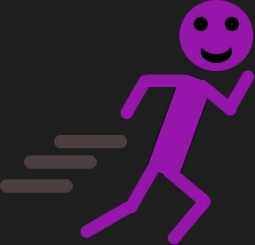

:warning: Everything between << >> needs to be replaced (remove << >> after replacing)

# Runner Game
## CS110 Final Project  Spring, 2024 

## Team Member

 Thirandi Dandeniya 

***

## Project Description

Runner Game is a basic side scrolling game where players dodge obstacles to survive as long as possible. Jump in and see how long you can keep running!!!

***    

## GUI Design

### Initial Design

### Final Design

## Program Design

### Features

1. Start menu
2. Moveable character
3. Obstacle collisions
4. Scrolling background
5. Game Over Screen

### Classes

- << You should have a list of each of your classes with a description >>

## ATP

| Step                 |Procedure             |Expected Results                   |
|----------------------|:--------------------:|----------------------------------:|
|  1                   | Run Counter Program  |GUI window appears with count = 0  |
|  2                   | click count button   | display changes to count = 1      |
etc...
